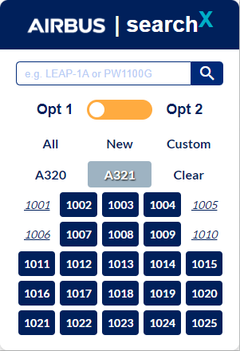
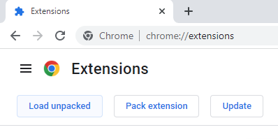

# Multisearch Chrome Extension

## Description

During the creation of Technical Data Publications for the conversion of Airbus A320 and A321 from passenger to freighter airplanes, we are often faced with the problem of searching data for multiple airplanes or MSNs (Manufacturer Serial Numbers). That means opening a chrome tab for each MSN and making the same search on each one. This can become very tedious and time consuming as the number of tabs may be well over 30. This chrome extension aims to solve this problem, as it provides the user with a search bar and buttons to choose exactly the MSNs he/she wants, and then opens a tab for each MSN with the same query, and groups them all together. The extension can of course be tweaked to fit cases where such problems araise.

## Features

As shown in Figure 1, there are buttons to help the user make a search for All MSNs, the New MSNs or make a custom search. 

There are also buttons to choose only the A320 or the A321 MSNs, as shown in Figure 2.

<figure align="center">
    
    
    
    <figcaption>
        <b>
            Fig.1 - Searching something for All MSNs, the New MSNs and making a Custom Search.
        </b>
    </figcaption>
</figure>

<figure align="center">
    
    
    <figcaption>
        <b>
            Fig.2 - Searching something for the Airbus A320 or A321 airplanes.
        </b>
    </figcaption>
</figure>

Moreover, there are buttons so the user can choose between two Options for the Technical Publication Manuals. As shown in Figure 3, each tab is named after the respective MSN to make navigating easier, and each tab group is coloured by the respective Option and is named after the search query.

<figure align="center">
    
     
     
    <figcaption>
        <b>
            Fig.3 - Grouped tabs for each option used.
        </b>
    </figcaption>
</figure>

## How to Install

1) Click "Manage extensions" at the top right of Google Chrome.
2) Enable "Developer mode".
3) Click "Load unpacked".
4) Browse to the location of the extension and select the whole folder.
5) The extension should appear in Google Chrome.
6) Click the "Pin" to pin the extension at the top right of Goggle Chrome.

<figure align="center">
    
    <figcaption>
        <b>
            1) Click "Manage extensions" at the top right of Google Chrome.
        </b>
    </figcaption>
</figure>

<figure align="center">
    
    <figcaption>
        <b>
            2) Enable "Developer mode".
        </b>
    </figcaption>
</figure>

<figure align="center">
    
    <figcaption>
        <b>
            3) Click "Load unpacked".
        </b>
    </figcaption>
</figure>

<figure align="center">
    
    <figcaption>
        <b>
            4) Browse to the location of the extension and select the whole folder.
        </b>
    </figcaption>
</figure>

<figure align="center">
    
    <figcaption>
        <b>
            5) The extension should appear in Google Chrome.
        </b>
    </figcaption>
</figure>

<figure align="center">
    
    <figcaption>
        <b>
            6) Click the "Pin" to pin the extension at the top right of Goggle Chrome.
        </b>
    </figcaption>
</figure>

## Configuration
For this example, simple Google links where used, but they can be modified to suit your specific needs. This can be done through the "DATA_INPUT.json" file and by changing the "matches" object in "manifest.json". Also, by modifying "DATA_INPUT.json" you can change the number of MSNs and which are considered "NEW" and which "A320". Just make sure that the number of MSN in the "ALL" object matches the number of name and the number of the keys for "Opt1" and "Opt2".